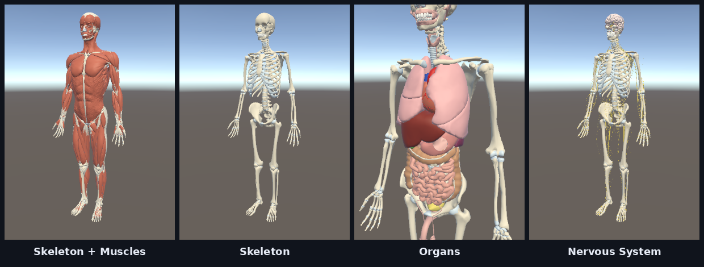
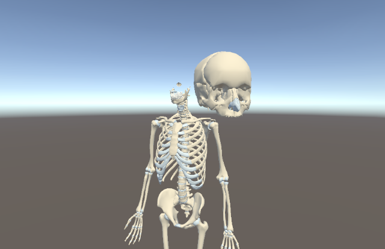
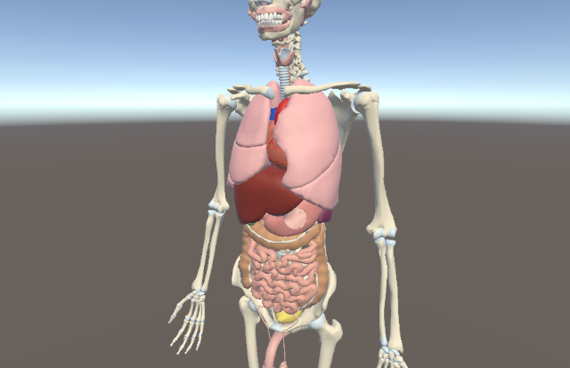

<div align="center">

# XR Human Anatomy

**A mixed-reality anatomy explorer for Meta Quest 3 / 3S.**
Place a life-size human body in your real room, peel it layer by layer, pull out the structures you are studying, turn them in your hands, scale them, and snap them back into place.




[**Install on Quest (PDF)**](docs/INSTALL_ON_META_QUEST.pdf) ·
[Features](#features) ·
[Controls](#controls) ·
[Build from source](#build-from-source) ·
[Architecture](docs/ARCHITECTURE.md) ·
[Changelog](CHANGELOG.md)

</div>

---

## Why this project

Anatomy is a 3D subject that is still mostly taught from 2D pages and screens. XR Human Anatomy lets a student stand next to a full-size body in passthrough, walk around it, and physically handle individual bones and organs. Students learn the shape and position of each structure by moving it, not just by reading its label.

## Features

| | Feature | Details |
|---|---|---|
| 🧍 | **Life-size placement in your room** | Aim and pinch with your right hand (or press **A**). The body stands on your real floor, using MRUK room data, and always at least 1 m away from you. |
| 🧩 | **5 anatomy layers** | Skeleton + Muscles → Skeleton → Muscles → Organs → Nervous System, switched from the palm menu. |
| ✋ | **Grab the famous structures** | 75 major structures (skull, femur, heart, lungs, liver, brain…) can be picked up with a pinch or a controller grip. Each one highlights when your hand gets close. |
| ↔️ | **Two-hand scaling** | Hold a part with both hands and pull it apart to enlarge it from 0.5× up to 3×. |
| 🧲 | **Snap back into place** | Release a part within 10 cm of its home position and it glides back to its exact spot. Release it further away and it stays floating in the air for study. |
| 🖐️ | **Palm menu** | In hand-tracking mode the menu follows your left palm. With controllers it sits on the left controller. |
| ♻️ | **Reset** | One button puts every part back and resets the body. |
| ⚡ | **Built for the Quest's mobile GPU** | About 1 M triangles, static batching, per-part mesh combining, fixed foveated rendering and a 72 Hz target. |

<table>
<tr>
<td width="50%"><br/><sub>Skull pulled out of the body and scaled up with two hands</sub></td>
<td width="50%"><br/><sub>Organs layer: heart, lungs, liver and digestive tract</sub></td>
</tr>
</table>

> Screenshots are taken from the Unity editor. On the headset the body is shown in passthrough, inside your real room.

## Install on Meta Quest

Read the step-by-step guide here: **[`docs/INSTALL_ON_META_QUEST.pdf`](docs/INSTALL_ON_META_QUEST.pdf)**. It is 3 pages long and covers the developer account, Developer Mode, installing with MQDH or adb, launching the app and troubleshooting.

Quick version for people who already have Developer Mode turned on:

```bash
adb install -r XRHumanAnatomy.apk
# Headset → Library → Unknown Sources → XR Human Anatomy
```

> The APK will be published on the **Releases** page once the first stable version is ready. Until then, build it from source using the steps below.

## Controls

| Action | Hand tracking | Touch controllers |
|---|---|---|
| Place the body | Aim with your right hand and pinch, or tap **Show Human Anatomy** | Aim and press **A** |
| Grab a part | Pinch on a highlighted part | Grip or trigger |
| Scale a part | Hold it with both hands and pull apart or push together | Same, with both controllers |
| Put a part back | Release it within 10 cm of its home position | Same |
| Next layer | **Layer** button on the palm menu | **Y** |
| Reset everything | **Reset** button | **X** |
| Remove the body | **Delete** button | — |
| Show or hide the menu | Always visible on your palm | **B** |

## Build from source

### Requirements

| Tool | Version |
|---|---|
| Unity | **2022.3.7f1**, installed with the *Android Build Support* module (including OpenJDK and the Android SDK & NDK tools) |
| Headset | Meta Quest 3 or 3S, with Developer Mode on |
| Git | Any recent version |

All Unity packages are restored automatically from `Packages/manifest.json`: Meta XR SDK 72.0.0, OpenXR 1.8.2, TextMeshPro and glTFast.

### Steps

```bash
git clone https://github.com/iamankit07/XR-Human-Anatomy.git
```

1. In **Unity Hub**, choose **Add → Add project from disk** and select the cloned folder.
2. Open the project. The first import takes a few minutes while Unity downloads the packages.
3. Open the scene **`Assets/Scenes/HunanAnatomy.unity`**.
4. Go to **File → Build Settings**, select **Android** and click **Switch Platform** if it isn't already selected.
5. Connect the headset and click **Build And Run**, or click **Build** and install the APK using the [install guide](docs/INSTALL_ON_META_QUEST.pdf).

The build settings are already configured: IL2CPP, ARM64, OpenXR with the Meta Quest feature group, and minimum API level 29.

## Project structure

```
XR-Human-Anatomy/
├── Assets/
│   ├── Scenes/HunanAnatomy.unity        Main (and only) scene
│   ├── Scripts/                         All gameplay code (see table below)
│   ├── Shaders/AnatomyGhost.shader      X-ray outline shader (optional snap-target ghost)
│   ├── Prefab/
│   │   ├── ZAnatomy.prefab              The body: 4 systems, 75 grabbable AnatomyPart groups
│   │   └── Menu.prefab                  Palm / controller menu
│   ├── Models/ZAnatomy_LOD/             Optimised Z-Anatomy meshes and ZA_* materials
│   ├── Resources/AnatomyDescriptions.json  1,898 structure descriptions (for upcoming labels)
│   ├── Meta_Productivity_App/           Menu icons (Meta MR sample)
│   ├── Plugins/Android/AndroidManifest.xml
│   └── XR/, Oculus/                     OpenXR and Meta project settings
├── Packages/manifest.json               Package dependencies
├── ProjectSettings/                     Unity project settings
├── docs/
│   ├── INSTALL_ON_META_QUEST.pdf        Headset install guide
│   ├── ARCHITECTURE.md                  How the systems fit together
│   └── images/                          README screenshots
├── CHANGELOG.md
├── THIRD_PARTY_NOTICES.md
└── README.md
```

### Scripts at a glance

| Script | Responsibility |
|---|---|
| `AnatomyPlacer` | Places the body with a right-hand pinch or controller ray, using an MRUK floor raycast and a minimum distance from the user. Also handles reset, delete and layer switching. |
| `AnatomyLayers` | Holds the 5 layer presets. At startup it combines meshes per part, adds colliders and kinematic rigidbodies, and static-batches everything that isn't grabbable. |
| `AnatomyPart` | Marks a grabbable structure. Stores its home pose and its renderers. |
| `AnatomyGrabber` | Handles pinch and grip grabbing, two-hand scaling, hover highlight and snap-back. |
| `MenuFeature` | Menu toggle, controller shortcuts and the layer label. Shortcuts are disabled while hands are tracked, because Meta maps a pinch to the A/X buttons. |
| `MenuHandFollow` | Keeps the menu on the left palm in hand-tracking mode. |
| `MenuRayPointer`, `RayButton` | Ray and poke interaction for the menu buttons. |
| `QuestPerformance` | Sets foveation, the refresh rate and other Quest performance settings. |

Read [`docs/ARCHITECTURE.md`](docs/ARCHITECTURE.md) for the data flow and the design decisions behind it.

## Roadmap

- [x] Life-size MR placement with hand tracking
- [x] Layer presets
- [x] Grab, two-hand scale and snap-back for 75 major structures
- [ ] **Labels:** show the name and a short description when a part is grabbed (data is already in `AnatomyDescriptions.json`)
- [ ] Higher-detail mesh while a part is held
- [ ] Quiz / puzzle mode (re-assemble the body against a timer)
- [ ] First public APK on the Releases page

## Known issues

- The scene file is named `HunanAnatomy.unity` (typo). It is kept as-is so existing scene references don't break.
- The Android package ID is still `com.DefaultCompany.XRHumanAnatomy`. It must be changed before any store submission. Changing it later means users have to uninstall and reinstall the app.
- With controllers, the left **Y** button toggles the menu *and* switches layers, because `OVRInput.Button.Two` covers both B and Y.

## Credits & licence

- **3D anatomy models:** [Z-Anatomy](https://www.z-anatomy.com/), licensed under **[CC BY-SA 4.0](https://creativecommons.org/licenses/by-sa/4.0/)**. The meshes in this repository were reduced and reorganised for real-time VR. Under the licence terms, these derived model assets are shared under the same CC BY-SA 4.0 licence.
- **Meta XR SDK** is subject to the [Meta Platform Technologies SDK licence](https://developers.meta.com/horizon/licenses/).
- Full list: [`THIRD_PARTY_NOTICES.md`](THIRD_PARTY_NOTICES.md).
- **Source code** (`Assets/Scripts`, `Assets/Shaders`) © 2026 iamankit07. All rights reserved. No open-source licence has been granted yet. Please open an issue if you would like to use the code.

<div align="center"><sub>Built with Unity and the Meta XR SDK · Made in India 🇮🇳</sub></div>
